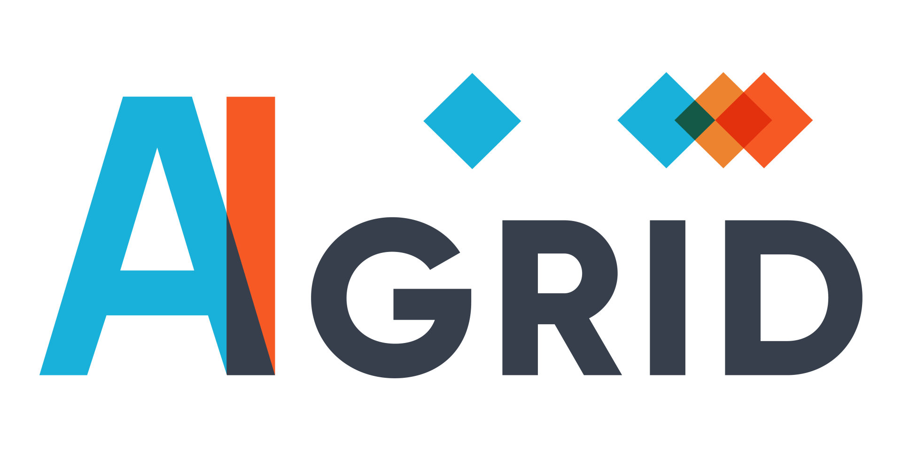
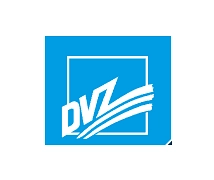

# Welcome to the AI Grid Hackathon

Our Hackathon features three distinct tracks for you to choose from. Whether you're interested in prompt engineering, time series forecasting or computer vision there's something here for everyone. You can focus on one track or challenge yourself by participating in multiple ones. Join us to innovate, collaborate, and make a real impact!

Each track presents challenges provided by local businesses, offering you the unique opportunity to develop AI solutions using real industry data. Your innovative solutions have the potential to benefit these businesses and make a significant impact.

## How to Start

1. Choose the track which interests you most
2. Choose if you want to join alone or in a team
3. If you want to join in a team: Join forces with others
4. Start Hacking

## Presentation of the Solution

We do not have quantitative metrics to evaluate your solutions. Nevertheless, it would be nice if you could present your solution on friday. This would first give the companies the chance to pick up on your great ideas. The winners per track will be crowned by all of us by vote.

## The Tracks

- [AI Tour Guide](tourism_mv.md) Harness the power of large language models through innovative prompt engineering. Can you create a sophisticated recommender system that suggests the perfect event or activity based on the weather and personal preferences?
- [Electric Load Forecasting](time_series_forecasting.md) Work on one of the hottest topics in renewable energy research today. Can you develop a forecasting algorithm which not only delivers accuracy but also excels at detecting load peaks?
- [Green Space Detection](green_space_detection.md) Vegetation and green spaces in cities are important. Can you help to identify where green spaces currently exist and help to find potential for optimization?

