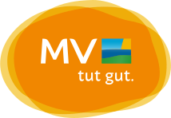

# AI Tour Guide

*Keywords: Natural Language Processing, Recommender System, Large Language Models, Prompt Engineering*

Are you ready to create an innovative tour guide that will elevate tourism in Mecklenburg-Vorpommern to the next level?

The [Tourism Association of Mecklenburg-Vorpommern](https://tmv.tourismus.mv/) has an extensive database of events and attractions in the region. Your task is to develop a tour guide that helps tourists plan their day.

The system/model should accept the following user inputs:

- Weather (e.g., Sunny, Rainy, etc.)
- Event/Attraction Category (e.g. Adventure, Culture, Party, Chillout, etc.)
- Date Range (e.g., 08/01/2024 - 08/15/2024)

Based on these inputs, the system should suggest suitable events and attractions that match the specified time, category, and weather conditions. 

To find out which event or attraction is most suitable in which weather, as well as the creation of meaningful categories, involves natural language processing (NLP) since this information needs to be extracted from descriptions or other information contained in the data. Whether you create and train your own model or integrate existing LLMs by "just" utilizing prompt engineering is up to you.

### Room for Creativity

We want to give you the freedom to define the exact inputs and outputs. You can decide how to categorize the weather or which activity categories make the most sense. Use your creativity and technical skills to develop the best system possible!

### About Your Solution

Again, it's entirely up to you whether you want to focus entirely on the logic/model or whether you want to create an end-to-end solution by creating a MVP (minimal viable product) with a rudimentary UI. 

If you choose the prompt engineering approach and use existing LLMs, you can also choose whether you want to run them locally or use a web API. However, if you run the LLMs locally, you must expect them to be very CPU-intensive, depending on their size. If you don't have enough local compute and are using a web API, it's fine if you don't use the whole dataset. Web APIs often have rate limits for free users. Here it is fine if you show the feasibility of your approach by just using parts of the dataset. However, it is of course good if you manage to show your approach on as many events or attractions as possible.

### Evaluation

There is no dedicated train test split or similar to quantitatively evaluate the performance of your approach. As with the other tracks in this hackathon, we are happy if you could present your solution on Friday. 

Particularly interesting is:

- What was your overall solution approach?
- Which problems did you encouter?
- Which LLM(s) did you use? And why these?
- Did you zero or few shot prompt? 
- ...

Bonus Points for:

- A small live demo of your solution
- The smaller the LLM the better. Big LLMs are very compute intense and require more expensive hardware
- If an open source LLM is used
- If you build a rudimentary UI so we can play around with your solution 😉

## The Dataset

**The link to the data will be shared during the event on site.**

An important piece of information is that the **descriptions of the events and attractions are in German**. You can choose whether you work with the data in German or whether you want to add translation as part of your pipeline (or model).

The dataset consists of 2 files:

### events.csv

Contains information about events.

### ausflugsziele.csv

Contains information about locations. Note that locations do not have opening hours. During the hackathon, we can assume that locations are always open.

## Further Reading & Information

### Prompt Engineering

- https://www.promptingguide.ai/
- https://help.openai.com/en/articles/6654000-best-practices-for-prompt-engineering-with-the-openai-api

### Using LLMs

- https://huggingface.co/docs/api-inference/en/index (Free usage of LLMs via web API on huggingface; Needs you to have a huggingface login)

### Building a UI Prototype UI

- [Streamlit](https://streamlit.io/) (or [Dash](https://dash.plotly.com/), but if you dont know either of both Streamlit is preferable for fast prototyping)
